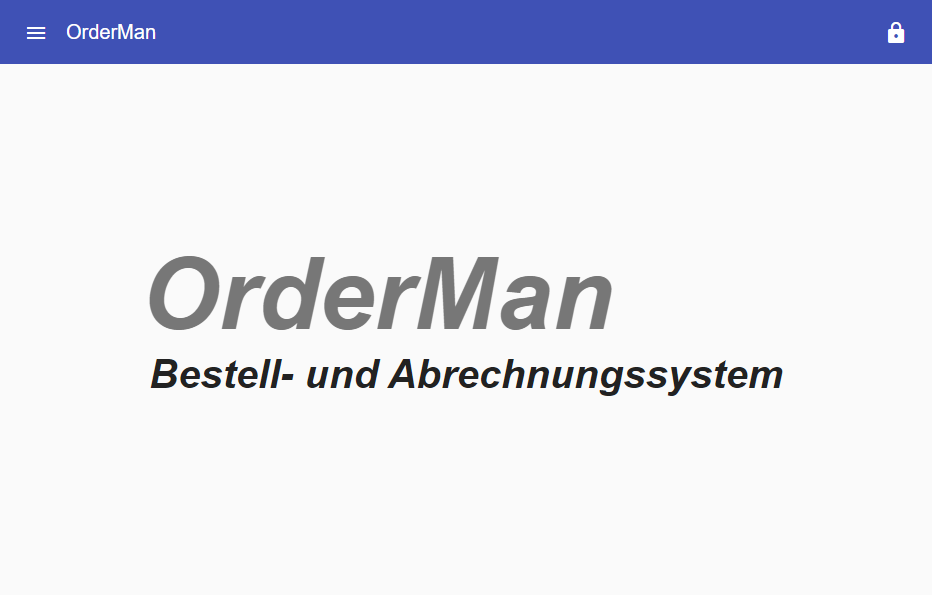
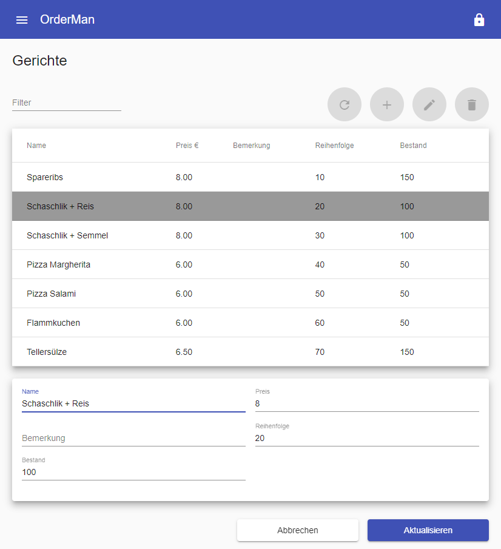
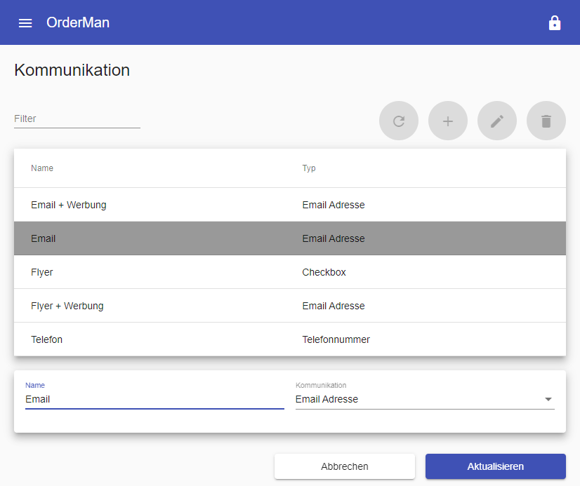
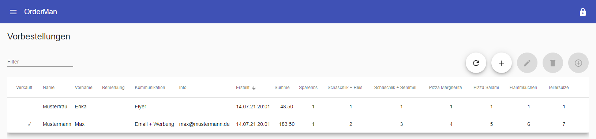
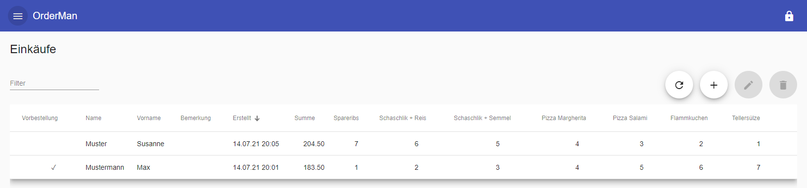
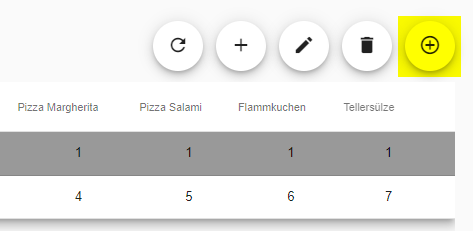
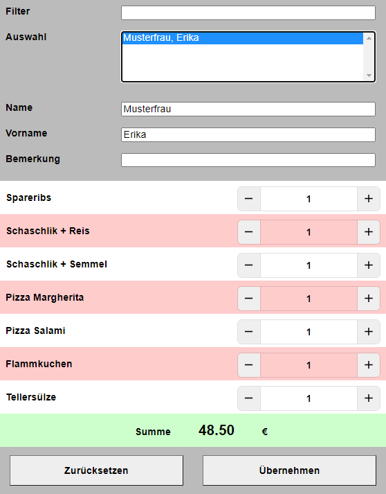
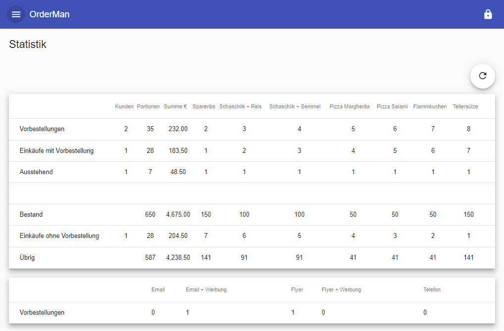
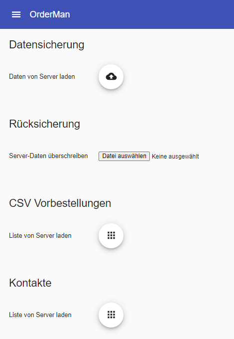
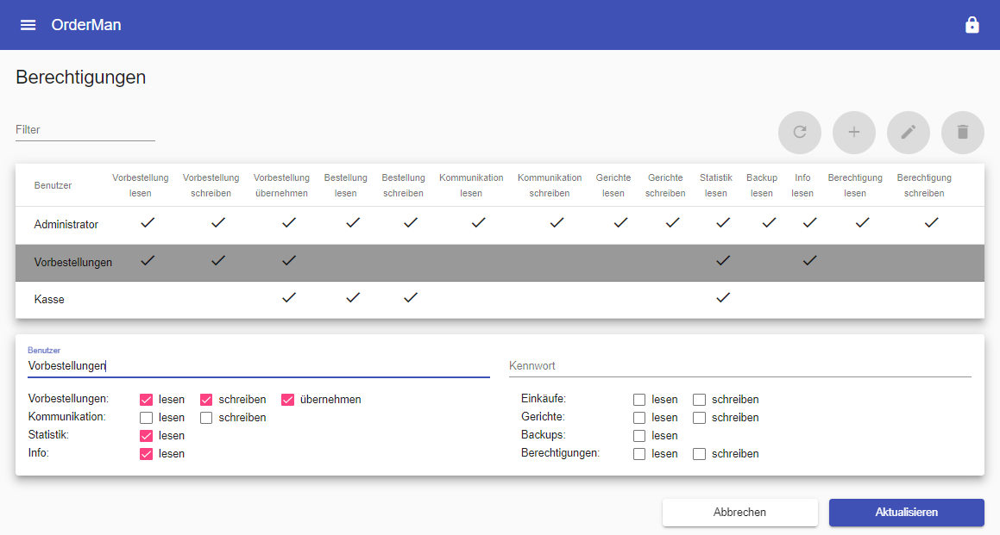

# OrderMan - Bestell- und Abrechnungssystem

OrderMan ist ein Software-System zur Erfassung von Vorbestellungen, der Durchführung von Einkäufen und der Organisation der Produktion. Entwickelt wurde das System zur Unterstützung von "TOGO Veranstaltungen", die auf Grund von Kontaktbeschränkungen während der Corona Pandemie populär wurden, kann aber auch ganz allgemein von Lieferdiensten verwendet werden.



Das Projekt wird zur Studie moderner Technologien, die auf dem Web-Stack basieren, verwendet. Eingesetzte Technoloien sind Angular, VUE.js, NestJS, MongoDB, ...


# Vielen Dank für Deine Spende!

Wenn Du dieses kostenlose Projekt unterstützen möchten, ist jede Hilfe willkommen. Du kannst spenden, indem Du auf einen der folgenden Links klickst:

[](https://www.paypal.me/gausma)
[](https://www.buymeacoffee.com/gausma)

# Funktionen

- Erfassung von Vorbestellungen
- Optimierte Durchführung und Erfassung von Einkäufen
- Frei konfigurierbare Gerichte und Kommunikationsformen
- Bestandsverwaltung und Restmengen
- Statistik
- Berechtigungs- und Benutzerverwaltung
- Datensicherung und -wiederherstellung
- Export von Erfassungslisten
- Multi-Client System (Erfassen von Vorbestellungen, Kassen, ...)

## Einrichten

Vor der Erfassung von Vorbestellungen und Einkäufen muss das System eingerichtet werden. Zuerst werden die Gerichte konfiguriert. *Name* und *Preis* werden in Bestell-Dialogen eingeblendet. Die *Reihenfolge* gibt die Sortierung vor. Der *Preis* und der *Bestand* werden zur Berechnung der Statistik verwendet. Die *Bemerkung* kann als Notiz verwendet werden.



Mit Hilfe der Kommunikations-Einträge kann bei der Erfassung von Vorbestellungen die Art der Bestellung erfasst werden. Falls diese Information nicht relevant ist, genügt es, einen Dummy-Eintrag zu erstellen. Der *Name* wird im Erfassungsdialog und der Statistik angezeigt. Der *Typ* wird zur Anzeige Feldern verwendet, mit denen Zusatzinformation erfasst werden kann.



Zur Abkürzung der Einrichtung kann eines der vorbereiteten Backups wiederhergestellt werden (siehe Kapitel Backup). 

## Erfassung

Die Erfassung der Daten gliedert sich in 2 Bereiche:
- Vorbestellungen   
  Kunden können ihre Gericht bestellen. Dabei werden die Kontaktinformationen und die bestellten Mengen erfasst.
- Einkäufe   
  Beim Bezahlen und Ausliefern einer Bestellung wird diese in einen Einkauf überführt. Dabei können die Mengen spontan angepasst werden. Ein Einkauf wird einer Vorbestellung zugeordnet. Dadurch kann ermittelt werden, welche Vorbestellungen noch auf sind. Einkäufe ohne Vorbestellungen sind auch möglich.





Für die Übernahme von Vorbestellungen in Einkäufe stehen 2 Möglichkeiten zur Verfügung. Der *Manager* bietet im Bereich der Vorbestellungen einen speziellen Übernahme-Button. Der erstellte Einkauf kann nachträglich angepasst (bearbeitet) werden.



Zur Übernahme steht zusätzlich eine spezielle App zur Verfügung, die die Übernahme und Anpassung wurde in einem Schritt optimiert. Sie kann auf Tablets oder Smartphones ausgeführt werden und wurde speziell für Kassensysteme entwickelt. Nach Auswahl einer Vorbestellung können die Mengen angepasst werden. Der abzurechnende Betrag wird just-in-time aktualisiert.



## Statistik

Die Statistik bietet eine Antwort auf mehrere Fragestellungen:
- Wie viele Vorbestellungen sind noch ausstehend, bzw. wurden übernommen?
- Wie viele Einkäufe wurden ohne Vorbestellung durchgeführt?
- Welche Einnahmen wurden erzielt?
- Wie hoch ist der Bestand?
- Wie hoch ist die Restmenge?
- Über welche Kommunikationsmedien wurden die Bestellungen durchgeführt?



## Datensicherung

Die Datensicherung bietet die Möglichkeit, den kompletten Datenbestand zu sichern oder wiederherzustellen. Durch *CSV Vorbestellungen* kann eine Liste abgespeichert werden, die in einer Tabellenkalkulation geöffnet und ausgedruckt werden kann. Sie kann bei einem Ausfall des Systems als Fallback dienen. Durch *Kontakte* kann eine Liste mit den erfassten Kontakten abgespeichert und weiter verarbeitet werden. Das muss natürlich im Rahmen der gültigen Datenschutzbestimmungen passieren.



## Berechtigungen

Falls die Anwendung durch mehrere Benutzer verwendet wird, kann sie im Bereich der Berechtigungen individualisiert werden. Falls kein Benutzer angelegt ist, wird alles erlaubt.



# Ausführung

## Installation

Voraussetzung für die Installation der Anwendung sind: 
- mongoDB   
  Version > 4.0   
  https://www.mongodb.com/try/download/community
- Node.js   
  Version > 14.15.3   
  https://nodejs.org/en/download/
- yarn   
  $ npm yarn -g
  
Nach dem Download des git Repositories werden die Module für die Anwendungen installiert. Jeweils in den Verzeichnissen der Anwendungen den nachfolgenden Befehl ausführen:
- ./clients/manager
- ./clients/order
- ./server
```
$ yarn install
```

## Bau

Die Anwendungen werden in ihren Verzeichnissen gebaut durch die Befehle:
- Clients
```
$ yarn build:translation
```
- Server
```
$ yarn build
```

## Start

Es genügt den Server zu starten (im Verzeichnis des Servers):
```
$ yarn start:prod
```   

## Öffnen

Die Anwendungen können jetzt im Browser geöffnet werden:
- Manager
```
http://localhost:1956/manager/de
http://localhost:1956/manager/en
...
```
- Kasse
```
http://localhost:1956/order/de
http://localhost:1956/order/en
...
```

# Hinweise

## MacOS MongoDB 

If you need to have mongodb-community@4.0 first in your PATH, run:
  echo 'export PATH="/usr/local/opt/mongodb-community@4.0/bin:$PATH"' >> /Users/Martin/.bash_profile

To have launchd start mongodb/brew/mongodb-community@4.0 now and restart at login:
  brew services start mongodb/brew/mongodb-community@4.0
Or, if you don't want/need a background service you can just run:
  mongod --config /usr/local/etc/mongod.conf

# Todo

Weitere Aufgaben:
- Client für die Produktion
- Statistik im Server berechnen
- Unit Tests 
- Prettier

# Lizenz

MIT License

Copyright (c) 2021 Martin Gaus

Permission is hereby granted, free of charge, to any person obtaining a copy
of this software and associated documentation files (the "Software"), to deal
in the Software without restriction, including without limitation the rights
to use, copy, modify, merge, publish, distribute, sublicense, and/or sell
copies of the Software, and to permit persons to whom the Software is
furnished to do so, subject to the following conditions:

The above copyright notice and this permission notice shall be included in all
copies or substantial portions of the Software.

THE SOFTWARE IS PROVIDED "AS IS", WITHOUT WARRANTY OF ANY KIND, EXPRESS OR
IMPLIED, INCLUDING BUT NOT LIMITED TO THE WARRANTIES OF MERCHANTABILITY,
FITNESS FOR A PARTICULAR PURPOSE AND NONINFRINGEMENT. IN NO EVENT SHALL THE
AUTHORS OR COPYRIGHT HOLDERS BE LIABLE FOR ANY CLAIM, DAMAGES OR OTHER
LIABILITY, WHETHER IN AN ACTION OF CONTRACT, TORT OR OTHERWISE, ARISING FROM,
OUT OF OR IN CONNECTION WITH THE SOFTWARE OR THE USE OR OTHER DEALINGS IN THE
SOFTWARE.
